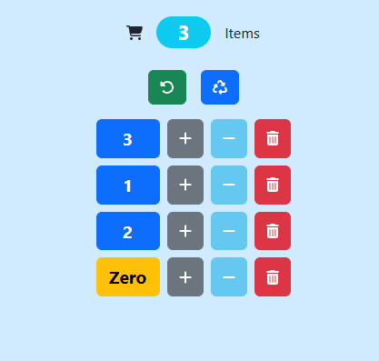

# Shopping Cart App

Simple shopping cart app built with Node.js and Express.
It lets you add, remove, and reset items while keeping track of what’s in the cart.

---

## Preview



---

## Features

* Add items to the cart
* Decrease or remove items
* Reset the cart
* Refresh cart state
* Uses EJS to render the UI

---

## Tech Used

* Node.js
* Express
* EJS
* HTML / CSS

---

## Project Structure

```
controllers/   - cart logic  
routes/        - route handling  
views/         - EJS templates  
public/        - CSS / static files  
app.js         - server entry point  
```

---

## How to Run

1. Install dependencies:

```
npm install
```

2. Start the server:

```
npm start
```

3. Open in browser:
   http://localhost:4000

---

## Notes

This started as a class project, but I cleaned it up and focused it on just the cart functionality.

---

## Future Improvements

* Save cart data (database instead of memory)
* Improve styling
* Add product data instead of hardcoded items
